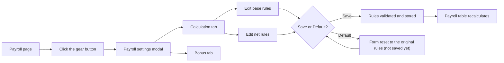
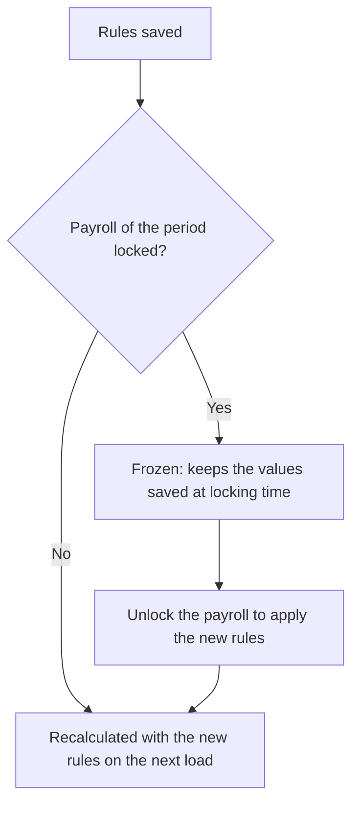
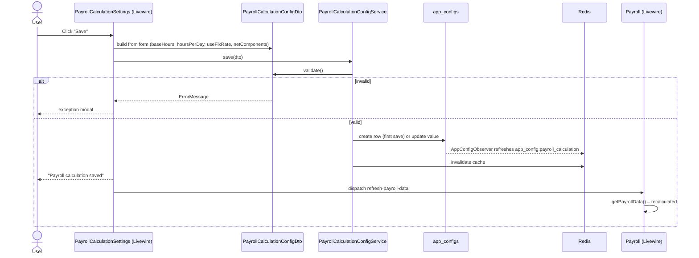
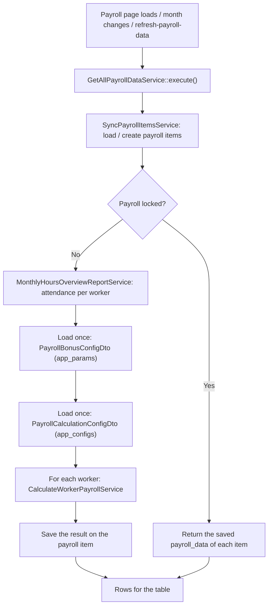
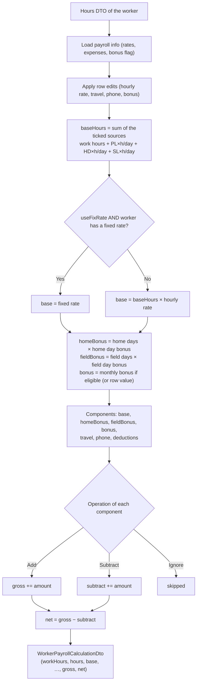
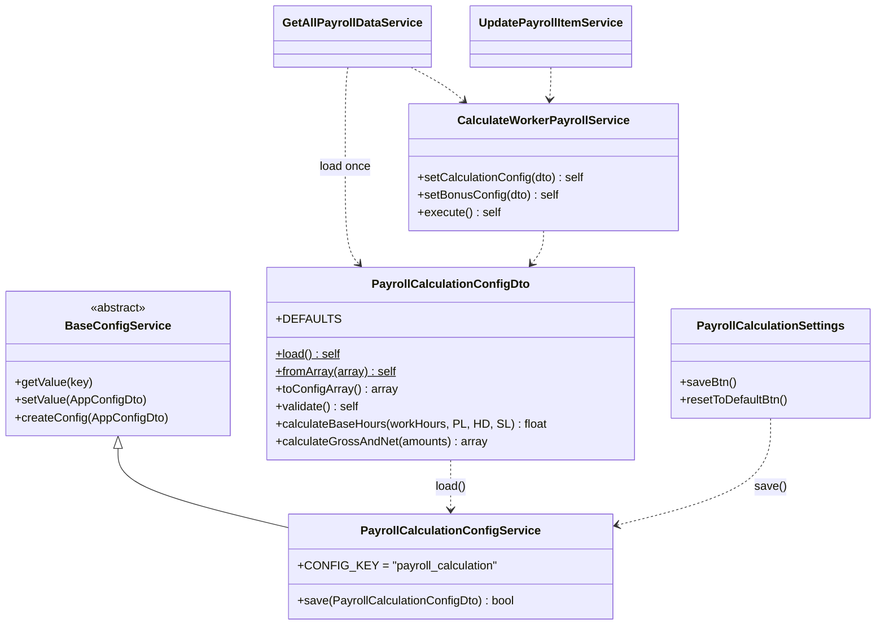

# Payroll Settings – Calculation Guide

## Overview

The payroll module no longer uses a hardcoded formula. The **Payroll settings** modal (the gear button in the payroll header) lets a user define:

1. **How the base is calculated**: which hours count and whether the fixed rate is used.
2. **How the net is calculated**: which amounts are added, subtracted or ignored.

The settings are **global**. They are not tied to a month, a payroll or a worker. One set of rules applies to every **unlocked** payroll. Locked payrolls are frozen and keep the values they had when they were locked.

The defaults reproduce the original calculation exactly, so nothing changes until someone edits the settings.

**Contents**

- [Part 1 – User guide](#part-1--user-guide)
- [Part 2 – How it works internally](#part-2--how-it-works-internally)
- [Part 3 – Developer reference](#part-3--developer-reference)
- [Troubleshooting / FAQ](#troubleshooting--faq)

---

## Part 1 – User guide

### 1.1 Opening the settings

1. Open **Finance & Accounting → Payroll**.
2. Click the blue **gear** button at the top right of the header, after the lock button.
3. The **Payroll settings** modal opens with two tabs:
   - **Calculation**: the base and net rules described in this guide.
   - **Bonus**: reserved for the bonus settings (placeholder for now).



### 1.2 The Calculation tab

The tab has two sections, **Base** and **Net**, and two buttons:

| Button | What it does |
|---|---|
| **Default** | Fills the form with the original rules. **Nothing is saved** until you click Save. |
| **Save** | Validates the rules, stores them, and recalculates the payroll table behind the modal. |

#### Base section

The base is the main part of the pay:

```
base = fixed rate                      (if "Use the fixed rate" is on AND the worker has a fixed rate)
base = base hours × hourly rate        (otherwise)
```

**Hours counted in the base**: tick the hour sources that make up the *base hours*:

| Option | Counted as |
|---|---|
| **Work hours** | Logged work hours from attendance |
| **Paid leave (PL)** | PL days × *hours per leave day* |
| **Holiday (HD)** | HD days × *hours per leave day* |
| **Sick leave (SL)** | SL days × *hours per leave day* |

**Hours per leave day**: how many hours one PL, HD or SL day is worth. The default is `8` and the allowed range is 0–24.

**Use the fixed rate instead of hours × hourly rate when the worker has one**: when this is on, a worker with a fixed monthly rate (set in the worker's payroll info) gets that amount as the base, whatever their hours. When it is off, every worker is paid by hours × hourly rate, even if they have a fixed rate.

#### Net section

Every amount calculated for a worker is a **component**. For each component you choose one operation:

| Operation | Effect |
|---|---|
| **Add** | Added to the gross |
| **Subtract** | Subtracted from the gross to get the net |
| **Ignore** | Not used at all |

```
gross = sum of all components set to "Add"
net   = gross − sum of all components set to "Subtract"
```

The **Overall [€]** column in the payroll table is the **net**.

Available components:

| Component | Where the amount comes from |
|---|---|
| **Base** | The result of the base section |
| **Home days bonus** | Home days × home day bonus (company setting) |
| **Field days bonus** | Field days × field day bonus (company setting) |
| **Monthly bonus** | The monthly bonus if the worker is eligible (see [1.5](#15-monthly-bonus-eligibility)), or the value typed in the Bonus column |
| **Travel expense** | Worker payroll info, or the value typed in the row |
| **Phone expense** | Worker payroll info, or the value typed in the row |
| **Deductions** | Sum of the deductions added for the worker on this payroll |

> All amounts go into the formula as **positive numbers**, deductions included. Choosing **Subtract** is what makes them reduce the net.

#### Default rules

| Setting | Default |
|---|---|
| Hours counted | Work hours, Paid leave, Holiday |
| Hours per leave day | 8 |
| Use fixed rate | On |
| Base, Home bonus, Field bonus, Monthly bonus, Travel, Phone | Add |
| Deductions | Subtract |

### 1.3 Validation

**Save** is refused with a message when:

| Rule | Message |
|---|---|
| No hour source ticked **and** fixed rate off | *Select at least one hour source or enable the fixed rate.* |
| Hours per leave day ≤ 0 or > 24 | *Hours per day must be between 0 and 24.* |
| No component set to **Add** | *At least one component must be added to the net.* |

### 1.4 Reading the payroll table

| Column | Meaning |
|---|---|
| **Work hours [h]** | Logged work hours only (no leave) |
| **PL / SL / HD [d]** | Number of paid leave / sick leave / holiday days |
| **Home / Field [d]** | Number of home / field work days |
| **Base hours [h]** | Hours used for the base, following the **Hours counted** setting |
| **Hourly rate [€]** | Editable per row |
| **Base [€]** | Fixed rate, or *Base hours × Hourly rate* |
| **Home / Field [€]** | Day bonuses |
| **Travel / Phone expense, Bonus [€]** | Editable per row |
| **Overall [€]** | **Net** |

> **Checking the numbers by hand:** multiply **Base hours** by **Hourly rate**. Don't add PL × 8 to *Work hours* yourself: *Base hours* already includes it.

### 1.5 Monthly bonus eligibility

The monthly bonus component is only non-zero when **all** of these are true:

1. The worker's payroll info allows the bonus.
2. The attendance report did not revoke it.
3. The worker had **no sick leave** days in the month.

A value typed into the **Bonus** column of a row always wins over this rule.

### 1.6 Worked examples

The examples use a worker with **156** logged hours, **2** PL days, **0** HD, **0** SL, an hourly rate of **50 €** and no fixed rate.

**Example A – default rules**

```
base hours = 156 + (2 × 8)            = 172
base       = 172 × 50                 = 8 600 €
```

**Example B – "Hours per leave day" = 7.5**

```
base hours = 156 + (2 × 7.5)          = 171
base       = 171 × 50                 = 8 550 €
```

**Example C – "Paid leave" unticked**

```
base hours = 156                      = 156
base       = 156 × 50                 = 7 800 €
```

**Example D – net rules**

Amounts: base 1 000, home bonus 50, field bonus 20, monthly bonus 100, travel 30, phone 10, deductions 40.

| Rules | Gross | Net |
|---|---|---|
| Default | 1000 + 50 + 20 + 100 + 30 + 10 = **1 210** | 1210 − 40 = **1 170** |
| Travel = *Ignore*, Phone = *Subtract* | 1000 + 50 + 20 + 100 = **1 170** | 1170 − (10 + 40) = **1 120** |

### 1.7 Which payrolls are affected?



- **Unlocked payroll**: recalculated with the current rules every time the table is loaded or a row value is edited.
- **Locked payroll**: shows the saved snapshot. Unlock it if you want the new rules applied, then lock it again.

---

## Part 2 – How it works internally

### 2.1 Saving the settings



### 2.2 Loading and calculating the payroll



### 2.3 The calculation of one worker



### 2.4 Editing a single row value

Changing *Hourly rate*, *Travel*, *Phone* or *Bonus* in a row calls `UpdatePayrollItemService`. It rebuilds the worker's hours DTO, runs `CalculateWorkerPayrollService` (which loads the rules itself) and saves the result on the payroll item. Row edits and the settings are therefore always calculated with the same rules.

---

## Part 3 – Developer reference

### 3.1 Storage

The rules live in **one row** of the `app_configs` table:

| Column | Value |
|---|---|
| `key` | `payroll_calculation` |
| `data_type` | `json` |
| `value` | Current rules |
| `default_value` | Original rules (`PayrollCalculationConfigDto::DEFAULTS`) |
| `is_public` | `true` |

`app_configs` was chosen over the legacy `app_params` table because it supports typed JSON values, a default value to reset to, labels and descriptions, audit fields (`created_by` / `updated_by`) and Redis caching through `BaseConfigService`.

Values are cached in Redis under `app_config:payroll_calculation` for 1 hour. `AppConfigObserver` refreshes the cache whenever the row is saved.

#### JSON schema

```json
{
  "base": {
    "hours": ["work-hours", "paid-leave", "holiday"],
    "hours-per-day": 8,
    "use-fix-rate": true
  },
  "net": {
    "base": "add",
    "home-bonus": "add",
    "field-bonus": "add",
    "bonus": "add",
    "travel-expense": "add",
    "phone-expense": "add",
    "deductions": "subtract"
  }
}
```

| Path | Allowed values |
|---|---|
| `base.hours[]` | `work-hours`, `paid-leave`, `holiday`, `sick-leave` |
| `base.hours-per-day` | number, `0 < x ≤ 24` |
| `base.use-fix-rate` | `true` / `false` |
| `net.<component>` | `add`, `subtract`, `ignore` |

Loading is tolerant: unknown keys and values are dropped, and anything missing falls back to the default. A missing row (installer not run yet) means the defaults apply, and the first save creates it.

### 3.2 Files

| File | Role |
|---|---|
| [app/Services/Payroll/PayrollCalculationConfigDto.php](../../app/Services/Payroll/PayrollCalculationConfigDto.php) | Rules value object: constants, defaults, `load()`, `fromArray()`, `toConfigArray()`, `validate()`, `calculateBaseHours()`, `calculateGrossAndNet()` |
| [app/Services/Config/PayrollCalculationConfigService.php](../../app/Services/Config/PayrollCalculationConfigService.php) | Reads/writes the `payroll_calculation` config (extends `BaseConfigService`), creates the row on the first save |
| [app/Services/Payroll/CalculateWorkerPayrollService.php](../../app/Services/Payroll/CalculateWorkerPayrollService.php) | Per-worker calculation, uses the rules (`setCalculationConfig()` or lazy load) |
| [app/Services/Payroll/GetAllPayrollDataService.php](../../app/Services/Payroll/GetAllPayrollDataService.php) | Loads the rules once and passes them to every worker's calculation |
| [app/Services/Payroll/WorkerPayrollCalculationDto.php](../../app/Services/Payroll/WorkerPayrollCalculationDto.php) | Result: `workHours` (logged) and `hours` (base hours) are separate |
| [app/Services/Payroll/PayrollExportDto.php](../../app/Services/Payroll/PayrollExportDto.php) | Excel export with *Work hours* and *Base hours* columns |
| [app/Livewire/Modules/FinanceAccounting/Components/PayrollSettingsModal.php](../../app/Livewire/Modules/FinanceAccounting/Components/PayrollSettingsModal.php) | Modal with the *Calculation* / *Bonus* tabs |
| [app/Livewire/Modules/FinanceAccounting/Components/PayrollCalculationSettings.php](../../app/Livewire/Modules/FinanceAccounting/Components/PayrollCalculationSettings.php) | Calculation tab form (save / default) |
| [resources/views/livewire/modules/finance-accounting/components/payroll-settings-modal.blade.php](../../resources/views/livewire/modules/finance-accounting/components/payroll-settings-modal.blade.php) | Modal view |
| [resources/views/livewire/modules/finance-accounting/components/payroll-calculation-settings.blade.php](../../resources/views/livewire/modules/finance-accounting/components/payroll-calculation-settings.blade.php) | Calculation tab view |
| [config/global-modal.php](../../config/global-modal.php) | Registers the `payroll-settings` modal |
| [installers/auto-installations/2026_09_24_120000_payroll_calculation_config.php](../../installers/auto-installations/2026_09_24_120000_payroll_calculation_config.php) | Auto-installer: seeds the config row with the defaults (never overwrites saved rules) |

### 3.3 Class relationships



### 3.4 Using the rules in code

```php
use App\Services\Payroll\PayrollCalculationConfigDto;
use App\Services\Config\PayrollCalculationConfigService;

// Read the current rules
$rules = PayrollCalculationConfigDto::load();

// Calculate many workers – load once, pass to every calculation
$calc = (new CalculateWorkerPayrollService($hoursDto))
    ->setCalculationConfig($rules)
    ->execute();

// Change and save the rules
$rules->setBaseHours([PayrollCalculationConfigDto::HOURS_WORK])
      ->setHoursPerDay(7.5)
      ->setNetComponent(PayrollCalculationConfigDto::COMPONENT_TRAVEL_EXPENSE, PayrollCalculationConfigDto::OPERATION_IGNORE);
(new PayrollCalculationConfigService())->save($rules); // validates, throws ErrorMessage when invalid
```

### 3.5 Extending

**Add a new hour source** (for example *misc work hours*):

1. Add a constant and an entry to `HOUR_SOURCES` in `PayrollCalculationConfigDto`.
2. Add a parameter and a line to the `$sources` map in `calculateBaseHours()`.
3. Pass the value from `CalculateWorkerPayrollService::execute()`.

The checkbox appears in the settings automatically, because the view loops over `HOUR_SOURCES`.

**Add a new net component** (for example *overtime*):

1. Add a constant and an entry to `COMPONENTS`, and add a default operation to `DEFAULTS['net']`.
2. Calculate the amount in `CalculateWorkerPayrollService::execute()` and add it to the array passed to `calculateGrossAndNet()`.
3. Optionally store and show it through `WorkerPayrollCalculationDto`, the table and the export.

The new row appears in the settings table automatically. Configs saved before the change get the default operation for the new component.

### 3.6 Setup

```bash
php artisan auto-install:check   # runs the installer that seeds the payroll_calculation row
php artisan config:clear   # only if the config is cached (global-modal.php changed)
```

Redis must be available, because `BaseConfigService` caches through it.

---

## Troubleshooting / FAQ

**The numbers don't match my manual calculation.**
Use **Base hours × Hourly rate**, not *Work hours*. Base hours already include PL, HD and SL days according to the settings. Also check whether the worker has a **fixed rate** and "Use fixed rate" is on.

**I saved new rules but the payroll didn't change.**
The payroll of that period is probably **locked**. Unlock it, and it is recalculated on the next load.

**An old locked payroll shows the same value in Work hours and Base hours.**
Payrolls locked before this feature did not store the logged work hours separately. The table falls back to the base hours for them.

**The attendance report still shows 8 h per leave day.**
`MonthlyHoursOverviewReportService` computes its own `work-hours-total` for other reports. The payroll no longer uses that value. It uses the logged work hours and the payroll settings.

**The settings modal doesn't open.**
Run `php artisan config:clear`. The `payroll-settings` key is read from `config/global-modal.php`.
